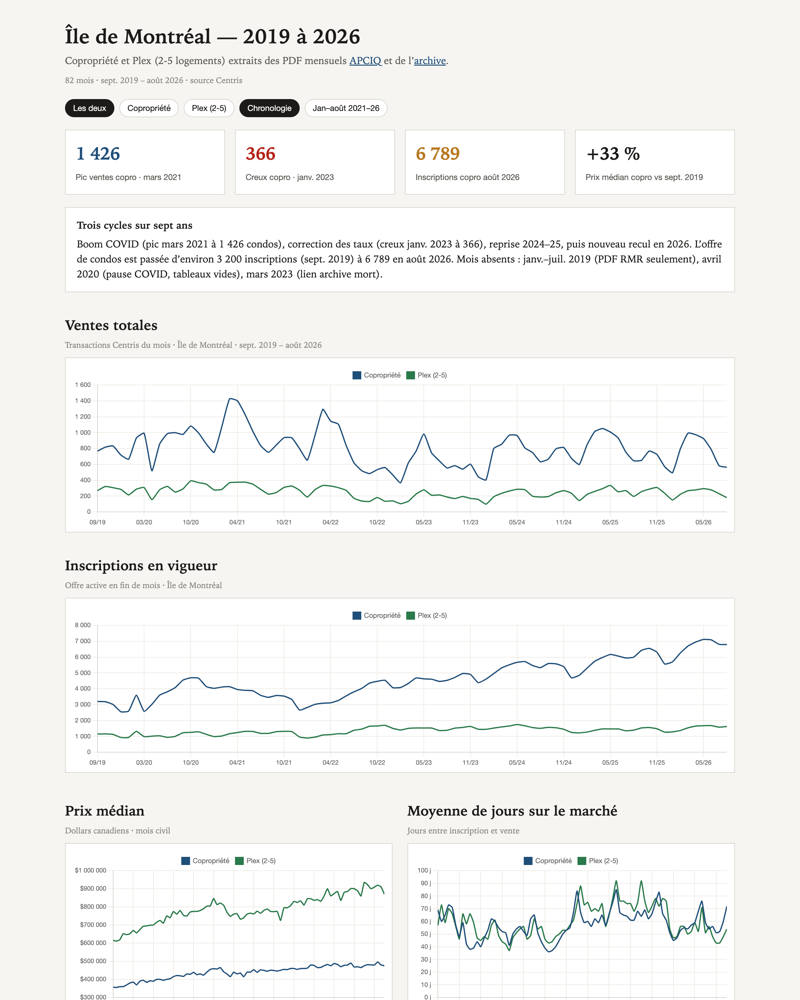

# Île de Montréal — 2019 à 2026

Monthly Centris figures for **Copropriété** and **Plex (2-5 logements)** on the Island of Montreal, extracted from [APCIQ](https://apciq.ca/barometre-residentiel/statistiques-mensuelles/) monthly PDFs.

Four series: ventes totales, inscriptions en vigueur, prix médian, moyenne de jours sur le marché.



Open the report: [`ile-montreal.html`](ile-montreal.html)

## Coverage

82 complete months, septembre 2019 – août 2026.

Missing months:

- Janvier–juillet 2019 — PDFs cover RMR Montréal only, not Île
- Avril 2020 — COVID pause, empty Île tables
- Mars 2023 — archive PDF link is dead

Août 2019 has ventes only and is omitted from the charts.

## Refresh the data

```bash
python3 -m venv .venv
source .venv/bin/activate
pip install -r requirements.txt
python scripts/fetch_monthly_stats.py
```

Reuse already-downloaded PDFs:

```bash
python scripts/fetch_monthly_stats.py --skip-download
```

Limit years:

```bash
python scripts/fetch_monthly_stats.py --years 2024 2025 2026
```

Outputs:

- `data/ile-montreal.json`
- `data/ile-montreal.csv`
- `data/pdfs/` (gitignored cache)

Sources: [statistiques mensuelles](https://apciq.ca/barometre-residentiel/statistiques-mensuelles/) and the [archive](https://apciq.ca/barometre-residentiel/statistiques-mensuelles-archive/).
